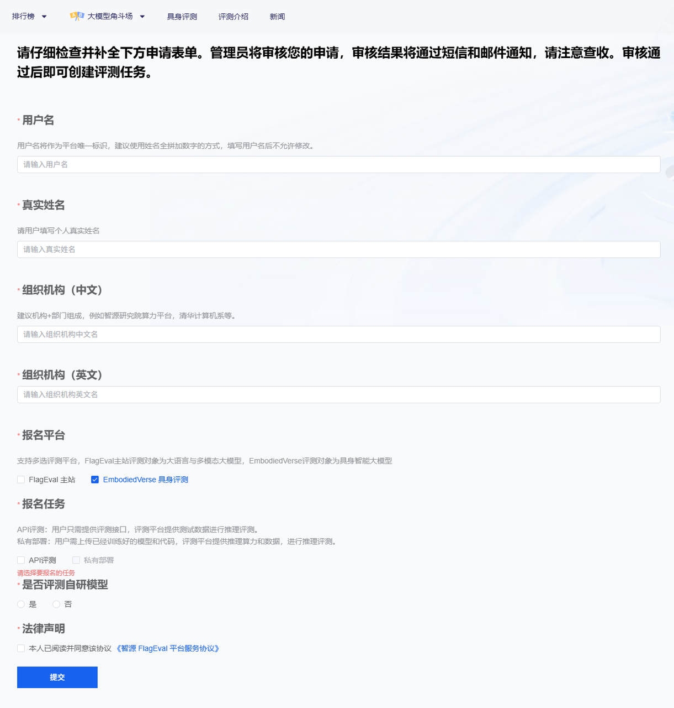
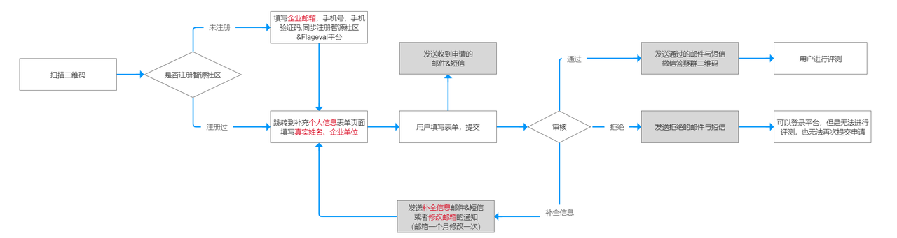
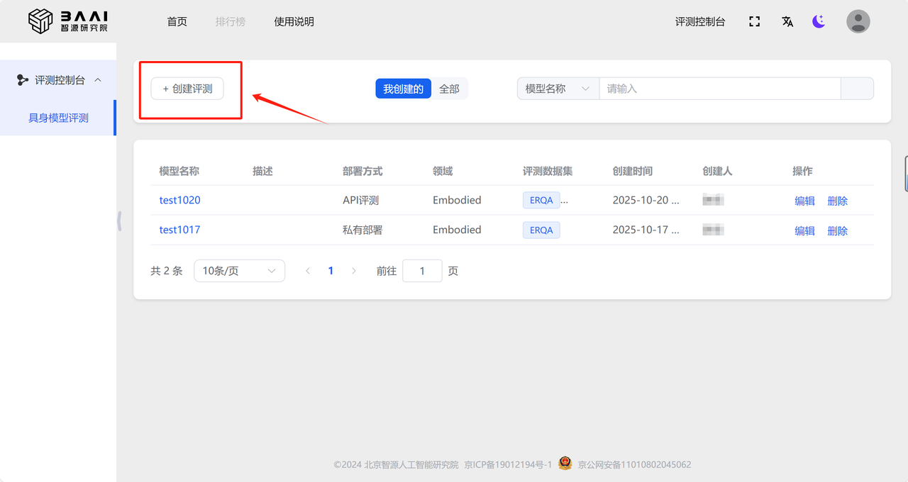
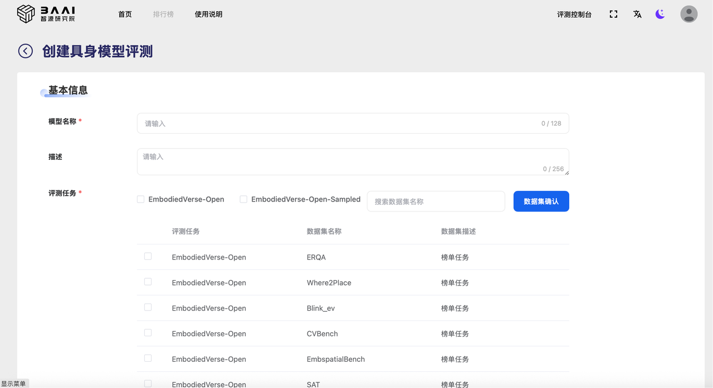

# 快速开始 
未注册用户默认拥有查看平台的首页和用户手册的权限。若需使用评测功能，用户需完成注册登录平台，在评测管理部分申请报名评测并补充完整个人信息，请确保提交信息准确有效，提交信息后，管理员审核通过后即可使用平台进行评测。

**具体操作方式如下：**

## 注册 
用户点击【登录/注册】按钮，弹出如下界面，初次使用平台先用**微信扫描二维码**，关注“智源社区小助手”微信公众号。

扫码关注后，界面变成如下样式，线上填写邮箱、手机号、验证码进行注册。 

注册完成后，跳转到平台首页，点击【评测控制台】，可报名评测，用户补充完整个人信息，平台管理员根据个人信息进行审核，审核通过的用户方可使用平台的评测功能。审核结果会以邮件的方式通知用户。

需要填写表单说明：

|参数|说明|
|:--|:--|
|用户名|<ul><li>用户名将作为平台唯一标识，建议使用姓名全拼加数字的方式，填写用户名后不允许修改。</li></ul><ul><li>长度3—128个字符，支持小写字母和数字，以小写字母开头。</li></ul>|
|真实姓名|<ul><li>请用户填写个人真实姓名，平台管理员审核时优先通过真实姓名。 </li></ul>|
|组织机构|<ul><li> 建议机构+部门组成，例如智源研究院算力平台，清华计算机系等，平台管理员审核时优先通过真实组织机构。 </li></ul><ul><li>组织机构需要填写中英文双语。 </li></ul>|
|报名平台|<ul><li> 支持多选评测平台。</li></ul><ul><li>【FlagEval主站】评测对象为大语言模型、多模态模型、语音大模型等。</li></ul><ul><li>【EmbodiedVerse】评测对象为具身智能方向，如VLA模型、具身智能大模型、真机评测。 </li></ul>|
|报名任务|<ul><li>支持多选任务。</li></ul><ul><li>【API评测】：用户只需提供评测接口，评测平台提供测试数据进行推理评测。 </li></ul><ul><li> 【私有部署】：用户需上传已经训练好的模型和代码，评测平台提供推理算力和数据，进行推理评测。</li></ul><ul><li> 【真机评测】：待上线</li></ul>|
|是否评测自研模型|<ul><li> 是 & 否，单选</li></ul>|
|协议声明|<ul><li>需要用户阅读并同意该协议后，才能使用平台的评测功能。 </li></ul> |

注册流程如下图所示：

**注：**
- 请认真填写个人信息，管理员会根据个人信息进行审核。
- 请填写有效邮箱和手机号，审核状态会通过邮件和短信进行通知，后续的评测任务状态也会通过邮件通知用户。
- 每个用户每个月有1次修改邮箱的机会。

## 登录
如用户已完成注册，点击【登录/注册】按钮，弹出【登录】页面，用户可以选择【微信-扫一扫】扫描屏幕上方的二维码登录，也可以选择【手机验证码】方式登录。

## 创建评测
用户点击【评测控制台】进入评测管理页面，进行具身模型评测。

点击【+创建评测】后，弹出【创建具身模型评测】对话框，根据不同需求填写相应表单信息，提交生成一条评测任务。

提交创建评测后，自动跳转到详情页面。若用户选择的【私有部署】，可以在详情页面点击查看【上传模型&代码】规范，利用flageval-serving工具上传模型与代码。上传完成后，点击【推理验证】快速验证推理评测代码是否可运行，通过验证后，点击【启动推理评测】进行正式推理评测过程，等待评测结束，即可查看评测结果。评测过程中如果遇到问题中断失败，可以通过日志查看错误信息。

